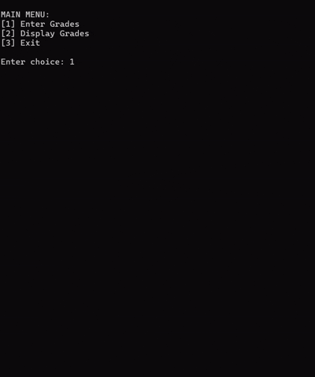

## Nested Menu
Make a nested menu similar to the following:

## Activity: Implementing Nested Menu Systems in Java

### Objective

The goal of this activity is to demonstrate proficiency in using **control flow structures** (specifically `while` loops and `switch-case` statements) to create an interactive, console-based user interface. You will implement a hierarchical menu system that allows users to navigate between a main dashboard and specific sub-functions.

---

### Instructions

1. **Project Setup**: Create a new Java class named `GradeSystem`.
2. **Main Menu Implementation**:
* Initialize a `Scanner` object to handle user input.
* Use an infinite `while(true)` loop to keep the program running until the user chooses to exit.
* Implement the following options:
* `[1]` Enter Grades (Leads to Sub-menu)
* `[2]` Display Grades (Calls a placeholder method)
* `[3]` Exit (Terminates the program using `System.exit(0)`)

3. **Nested Menu (Sub-menu) Logic**:
* Create a private static method named `enterGradesMenu()`.
* Inside this method, implement a **secondary loop**.
* The user must be able to choose between three subjects: `COMPRO2`, `DSA`, and `OOP`.
* Include a **"Go Back"** option (`0`) that successfully exits the sub-menu loop and returns the user to the Main Menu.

4. **Modularization**:
* Ensure that the "Display Grades" logic is separated into its own method named `displayGrades()`.
* For this activity, you only need to provide "placeholder" print statements (e.g., "Grades saved...") where the actual logic would eventually go.

5. **Input Handling**: Provide a `default` case in your switch statements to handle invalid numerical inputs gracefully.

---

### Grading Rubric (Total: 20 Points)

| Criteria | 5 (Excellent) | 3 (Developing) | 1 (Beginning) | Score |
| --- | --- | --- | --- | --- |
| **Logic & Control Flow** | Loops and switch-cases are perfectly nested; navigation is seamless. | Loops work but navigation between menus is clunky or buggy. | Infinite loops or broken logic prevent menu navigation. |  |
| **Modularization** | Code is cleanly divided into specific methods (`main`, `enterGradesMenu`, etc.). | Most code is modular, but some logic is misplaced in the main method. | All code is written inside the main method (Spaghetti code). |  |
| **Functionality** | "Go Back" and "Exit" features work exactly as specified. | One of the navigation features (Exit or Go Back) fails to work. | Program cannot navigate back or exit without crashing. |  |
| **Code Quality** | Variable naming is clear; indentation is consistent and readable. | Code is readable but lacks proper indentation or clear naming. | Code is messy, hard to read, and lacks formatting. |  |
| **Total Score** |  |  | **/ 20** |  |

